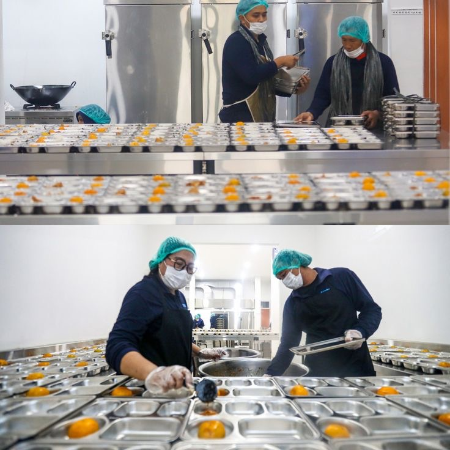

<!DOCTYPE html>

<html>

<head>

<title>
NutriPlan MBG
</title>

<link
rel="stylesheet"
href="style.css">

<meta
name="viewport"
content="width=device-width, initial-scale=1">

</head>

<body>

<!-- NAVBAR -->

<nav>

<h3>

NutriPlan MBG

</h3>

Universitas Diponegoro

<a href="#home">

Beranda

</a>

<a href="#hasil">

Parameter

</a>
<a href="#alur">

Metode

</a>

<a href="#tim">

Tim

</a>

<a
href="#simulation-result"
class="nav-button">

Simulasi

</a>

</nav>

<!-- HERO -->

<section
id="home"
class="hero">

🍱 Nutrition Optimizer

<h1>

Sistem Optimasi
Menu Bergizi Gratis

</h1>

<h4>

Berbasis
Chance Constrained Programming
dan
Genetic Algorithm

</h4>

Model optimasi untuk menghasilkan
rekomendasi menu bergizi
yang memenuhi kebutuhan gizi
dan efisien secara biaya.

53 Menu
•

32 Tambahan
•

CCP + GA

<h3>

Jalankan Simulasi

</h3>

<select id="jenis">

<option>

Menu Basah

</option>

<option>

Menu Kering

</option>

</select>

<input
type="number"
id="budget"
value="15000"
placeholder="Target Biaya">

<select
id="prioritas">

<option>

Protein Tinggi

</option>

<option>

Serat Tinggi

</option>

<option>

Energi Tinggi

</option>

<option>

Biaya Minimum

</option>

</select>

53+

Menu

95%

CCP

GA

Optimasi

<button
type="button"
onclick="generateMenu()">

🧬 Jalankan Optimasi

</button>

</section>

<!-- HASIL OPTIMASI -->

<section>

</section>

<!-- PARAMETER -->

<section
id="hasil"
class="hasil">

<h2>

Parameter Model

</h2>

Model menggunakan
Chance Constrained Programming (CCP)
dengan confidence level 95%.

<h3>
500
</h3>

Minimum Energi

<h3>
15 g
</h3>

Minimum Protein

<h3>
20 g
</h3>

Minimum Lemak

<h3>
100 g
</h3>

Minimum Karbohidrat

<h3>
5 g
</h3>

Minimum Serat

<h3>
Rp15.000
</h3>

Target Biaya

<h3>
95%
</h3>

Confidence CCP

</section>

<!-- METODE -->

<section
id="alur"
class="alur">

<h2>

Metode Optimasi

</h2>

Input →
Constraint →
CCP →
Fitness →
GA →
Output

01

<h3>

📥 Dataset

</h3>

Menu Basah 
Menu Kering 
Item Tambahan

02

<h3>

📊 Constraint

</h3>

Energi ≥ 500 
Protein ≥ 15 
Biaya ≤ 15000

03

<h3>

🧬 Optimasi

</h3>

CCP

→

Fitness

→

GA

04

<h3>

🍱 Output

</h3>

Top 6 Menu 
Total Gizi 
Total Biaya

</section>

<!-- TIM -->

<section
id="tim"
class="tim">

<h2>

Tim Peneliti

</h2>

<h3>

Viola Izzatul Umami

</h3>

Matematika S1

<h3>

Titis Setyo Widanti

</h3>

Matematika S1

<h3>

Yosi Risti Putika Sari

</h3>

Matematika S1

</section>

<footer>

NutriPlan MBG © 2026 —
Universitas Diponegoro

</footer>

</body>

</html>
